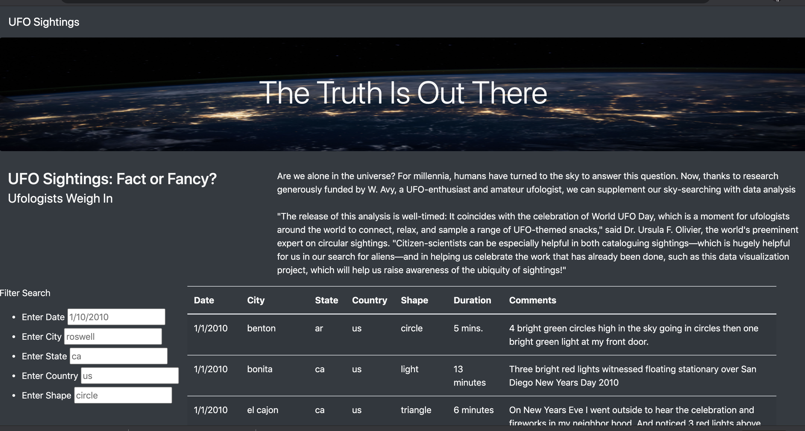
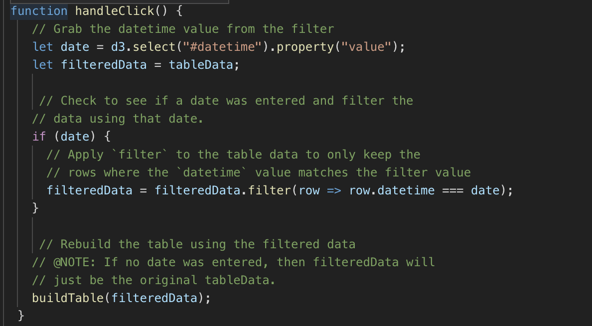

# UFOs

## Overview of Project
This project was to create a dynamic webpage that will display UFO sightings that have been recorded across the world. This webpage allows users to filter based on state, country, date, or shape of the sightings. All of this would be achieved using JavaScript and HTML/CSS. 

## Results

To navigate this webpage, the user will begin by inputing any filtering criteria that they want to view from the table of sightings and descriptions about the sightings.

 The user will enter there preference and then click onto the next filter criteria to activate the search. 
 
 
 With no filter crieteria entered it will display the entire dataset of UFOs sightings.

## Summary

One drawback to this new design is that without a specific button the user error might occur with the person using the webpage not knowing how to manuever around the filtering. One recommendation is to incorporate a button that would update the search manually. Another drawback is that the dataset will not include any new sightings. The seconond recommendation I have for that is to incorporate an API search method to pull current monthly data to include with the table.

